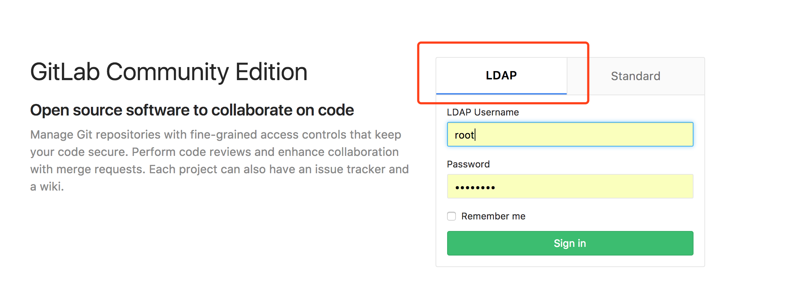

# gitlab

  see: https://hub.docker.com/r/gitlab/gitlab-ce/


Dockerfile [ci-and-cd/docker-gitlab on Github](https://github.com/ci-and-cd/docker-gitlab)

[cirepo/gitlab on Docker Hub](https://hub.docker.com/r/cirepo/gitlab/)


1. Prepare directories and files on host

<del>
```
mkdir -p ${HOME}/.ci-and-cd/gitlab.local/etc/gitlab ${HOME}/.ci-and-cd/gitlab.local/var/opt/gitlab ${HOME}/.ci-and-cd/gitlab.local/var/log/gitlab
chmod -R 777 ${HOME}/.ci-and-cd/gitlab.local
```
</del>

2. Environment variables

  `export GIT_HOSTNAME=gitlab.local`

  Skip auto repo init, this works only after initialized at least once
  `export SKIP_AUTO_REPO_INIT=true`

  Set http prot (default 10080)
  `export GIT_HTTP_PORT=10080`

  Default deploy key is same as configserver's deploy key (/app/gitlab/data/default_deploy_key.pub).
  You can change it by mount a new key and set a new value for GIT_DEPLOY_KEY.
  Access gitlab's group_name/repo_name/settings/repository page to manage Deploy Keys.
  `export GIT_DEPLOY_KEY=/etc/gitlab/default_deploy_key.pub`

3. Boot

    `docker-compose up -d`

It will mount WORKSPACE_ON_HOST (default is ../../) as workspace, find git repo there, create project for them 
automatically.


4. Entry point methods

  Export private key
  `docker exec gitlab.local /app/gitlab/entrypoint.sh export_git_admin_key > ~/.ssh/gitlab.local && chmod 600 ~/.ssh/gitlab.local`

## LDAP

- Use docker-compose environment variable GITLAB_OMNIBUS_CONFIG to config.

- or Edit `/etc/gitlab/gitlab.rb` e.g. `docker exec -it gitlab.internal /bin/bash`

Make its content like this:
```ruby
        gitlab_rails['ldap_enabled'] = true
    
        ###! **remember to close this block with 'EOS' below**
        ###! **remember to close this block with 'EOS' below**
        gitlab_rails['ldap_servers'] = YAML.load <<-'EOS'
           main: # 'main' is the GitLab 'provider ID' of this LDAP server
             label: 'LDAP'
             host: 'ldap.internal'
             port: 389
             uid: 'cn'
             method: 'plain' # "tls" or "ssl" or "plain"
             bind_dn: 'cn=admin,dc=internal'
             password: 'admin_pass'
             active_directory: true
             allow_username_or_email_login: false
             block_auto_created_users: false
             base: 'cn=developer,ou=user,dc=internal'
             user_filter: ''
             attributes:
               username: ['uid', 'userid', 'sAMAccountName']
               email:    ['mail', 'email', 'userPrincipalName']
               name:       'cn'
               first_name: 'givenName'
               last_name:  'sn'
        #     ## EE only
        #     group_base: ''
        #     admin_group: ''
        #     sync_ssh_keys: false
        #
        #   secondary: # 'secondary' is the GitLab 'provider ID' of second LDAP server
        #     label: 'LDAP'
        #     host: '_your_ldap_server'
        #     port: 389
        #     uid: 'sAMAccountName'
        #     method: 'plain' # "tls" or "ssl" or "plain"
        #     bind_dn: '_the_full_dn_of_the_user_you_will_bind_with'
        #     password: '_the_password_of_the_bind_user'
        #     active_directory: true
        #     allow_username_or_email_login: false
        #     block_auto_created_users: false
        #     base: ''
        #     user_filter: ''
        #     attributes:
        #       username: ['uid', 'userid', 'sAMAccountName']
        #       email:    ['mail', 'email', 'userPrincipalName']
        #       name:       'cn'
        #       first_name: 'givenName'
        #       last_name:  'sn'
        #     ## EE only
        #     group_base: ''
        #     admin_group: ''
        #     sync_ssh_keys: false
        EOS
```

- Restart gitlab `docker-compose restart`

- Verify LDAP config


- Sign in as admin and turn off user registration

## gitlab official docker-compose port and external_url config

see: https://docs.gitlab.com/omnibus/docker/#install-gitlab-using-docker-compose

Example:
```yaml
...
  environment:
    GITLAB_OMNIBUS_CONFIG: |
      external_url 'http://gitlab.example.com:9090'
      gitlab_rails['gitlab_shell_ssh_port'] = 2224
  ports:
    - '9090:9090'
    - '2224:22'
...
```
